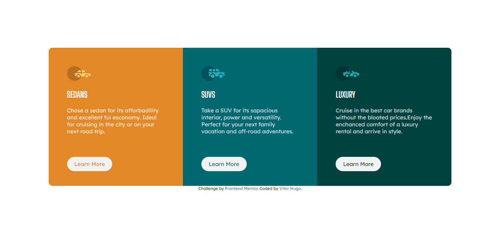
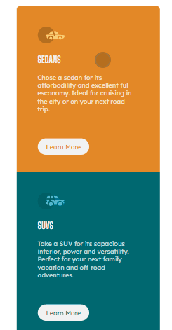

# Frontend Mentor - 3-column preview card component solution

This is a solution to the [3-column preview card component challenge on Frontend Mentor](https://www.frontendmentor.io/challenges/3column-preview-card-component-pH92eAR2-). Frontend Mentor challenges help you improve your coding skills by building realistic projects. 

## Índice

- [O desafio](#o-desafio)
- [Screenshot](#screenshot)
- [Links](#links)
- [Como pensei ao construir](#como-pensei-ao-construir)
- [Construi com](#construi-com)
- [O que pude aprender](#o-que-pude-aprender)
- [Alguns destaques](#destaques)
- [Autor](#autor)


### O desafio

Os usuários devem ser capazes de:

- Ver o layout ideal da página dependendo do tamanho da tela do dispositivo.
- Ver os estados de foco para todos os elementos interativos na página.

### Screenshot




### Links

- Solução: [Github](https://github.com/Vitor5782/Projeto-5-FrontEndMentor)
- Live Site URL: [GithubPages](https://vitor5782.github.io/Projeto-5-FrontEndMentor/)

### Como pensei ao construir:
    Pensando sobre o projeto:
Na main eu vou usar um flex para alinhar todo mundo isso significa que vou trabalhar com um section com 3 divs
Dentro de cada div eu tnetho 1 img 1 h2 um P e um link
Cada div tem uma cor e todas tem o mesmo tamanho
Nos links quando o mouse estiver em cima eles tem um efeito de hover
No modelo desktop eu tenho 1 linha com 
No mobile eu tenho que mudar o grid para que haja uma unica coluna
    No style-guide:
Temos as 3 cores que vamos usar nas divs
2 cores para paragrafos e 'bg, headings, buttons'
O body tem uma fonte de 15px
        2 fontes:
        //Lexend deca: weights 400 provalmente para os paragrafos e etcs
        //Big Shoulders Display: weight 700 para os titulos ctz
O footer tem uma font-size 11px

### Construi com:

- HTML Semantico
- CSS Propriedades de estilos
- Flexbox
- CSS Grid
- CSS Pseudo-Classes

### O que pude aprender:

Aprendi a como utilizar o grid-areas e pude construir meu html de forma semantica e ordenada.

### Destaques:

```html
<main>
        <section class="container">
            <div class="sedans">
                <div class="carro">
                    
      ....
```
```css
.sedans h2,
.suvs h2,
.luxury h2 {
    font-weight: 700;
    font-family: var(--font-highlights);
    color: var(--color-highlights);
}
```
### Autor:

- Frontend Mentor - [@Vitor5782](https://www.frontendmentor.io/profile/Vitor5782)
- Github - [@Vitor5782](https://github.com/Vitor5782)